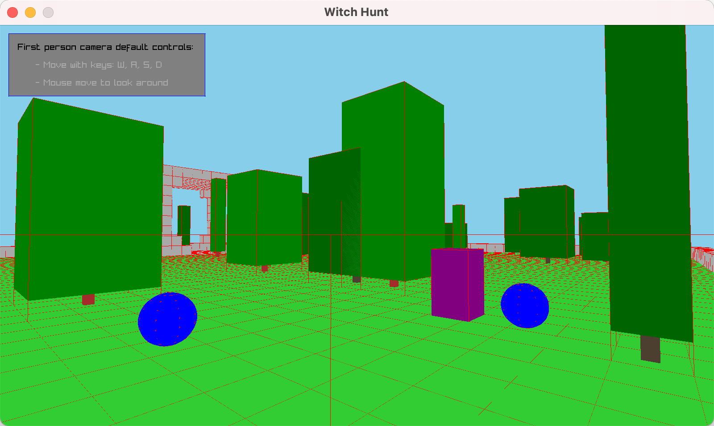

# Witch Hunt

3D world experiment built with Rust/Raylib/Rapier/Hecs. 🧙‍♀️

 

**Download:** https://github.com/hexensemble/witch-hunt/releases

Supports Mac and Windows.

 

This is just me prototyping and experimenting with different systems, some parts could definitely be implemented better.

**Features:**

- 🗺️ Grid-based world from Tiled maps
- 🧱 Block generation
- 🌳 Trees
- 🏀 Physics
- 🧙‍♀️ Enemy witch AI
- 🌐 Wireframe debug view

It's an incomplete project that's about done for now. Enemy pathfinding proved tricky to get working, and while Tiled is great for 2D, it’s not ideal for generating 3D worlds.

That said, it’s been a great learning experience, I picked up rendering with Raylib, physics with Rapier, and ECS with Hecs. I also learned valuable concepts and architectures that I’ll carry into my next project: exploring Bevy, which should provide a more complete and unified engine compared to my current stack.
