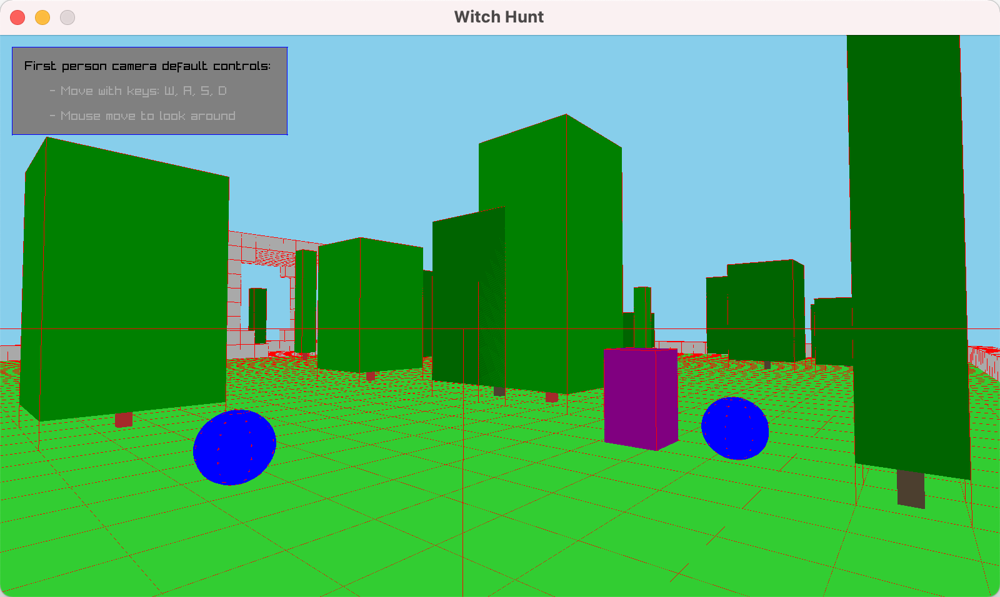

# Witch Hunt

3D world experiment built with Rust/Raylib/Rapier/Hecs. 🧙‍♀️

 

Prototyping and experimenting with 3D graphics, physics, and ECS. Map contains trees, some balls, and a cuboid witch who chases you using rudimentary pathfinding. The block-based world is laid out in Tiled (wouldn't recommend for 3D btw). Wireframe debug view is enabled so you can see physics bounds.

 

 

**Download:** https://github.com/hexensemble/witch-hunt/releases

 

Supports Mac and Windows.
